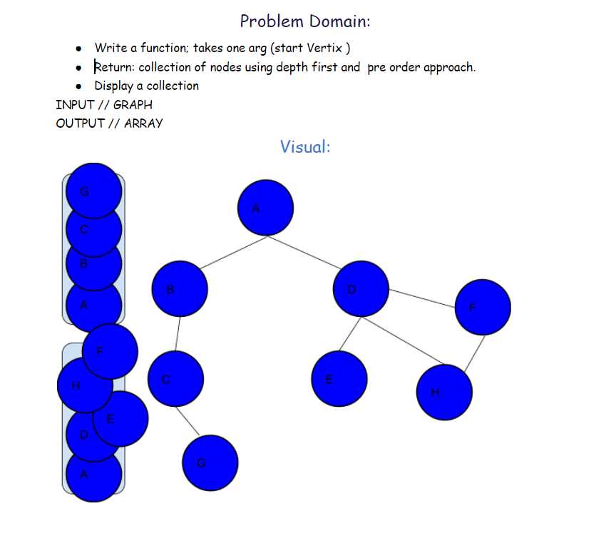
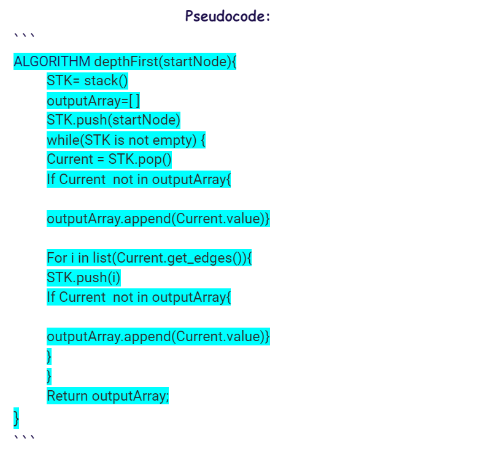
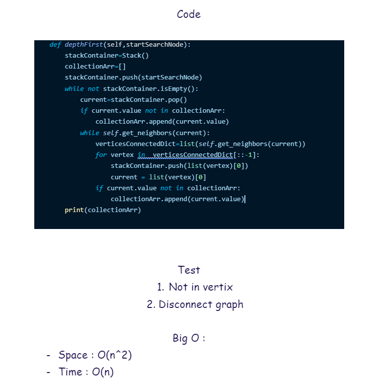

# Challenge Summary
<!-- Description of the challenge -->
add depthFirst method 
    * Arguments: Node (Starting point of search)

    * Return: A collection of nodes in their pre-order depth-first traversal order

## Whiteboard Process
<!-- Embedded whiteboard image -->

## Approach & Efficiency
<!-- What approach did you take? Why? What is the Big O space/time for this approach? -->
time: O(n^2)
Space: O(n)
## Solution
<!-- Show how to run your code, and examples of it in action -->
you can check the code from [here](../graphs/graph.py) and test [here](../graphs/test_graph.py)