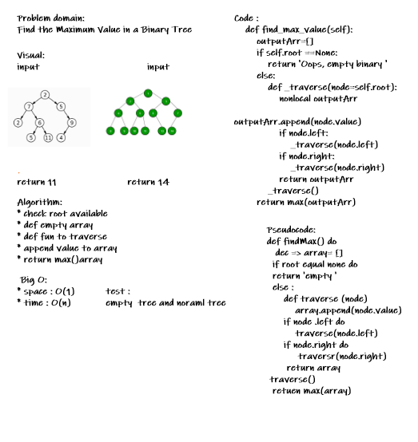

# Challenge Summary
<!-- Description of the challenge -->
add the method which return the max node value from braimary tree 
## Whiteboard Process
<!-- Embedded whiteboard image -->

## Approach & Efficiency
<!-- What approach did you take? Why? What is the Big O space/time for this approach? -->
check the root node , return empty in empty tree case
loop through all nodes and put it in array and return max from the array 
## Solution
<!-- Show how to run your code, and examples of it in action -->
[you can check all code from here](./tree.py)