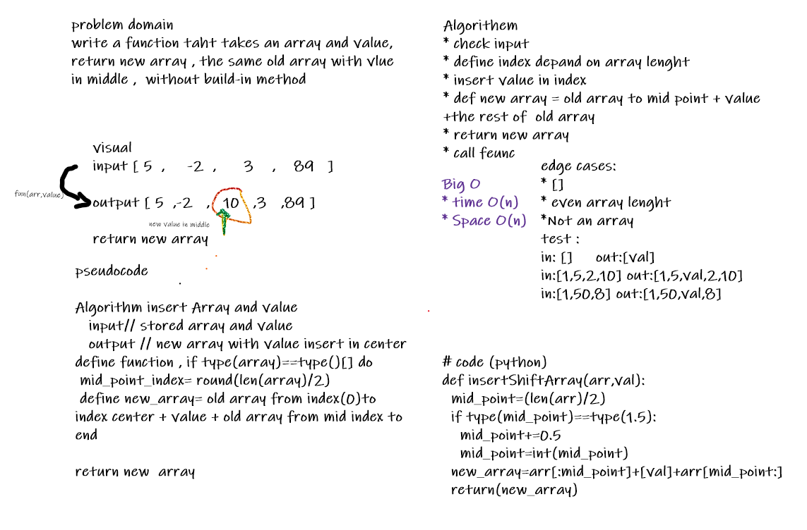

# Reverse an Array
<!-- Description of the challenge -->
Write a function called insertShiftArray which takes in an array and a value to be added. Without utilizing any of the built-in methods available to your language, return an array with the new value added at the middle index.

## Whiteboard Process
<!-- Embedded whiteboard image -->

## Approach & Efficiency
<!-- What approach did you take?
 Discuss Why. What is the Big O space/time for this approach? -->
check input type  , select middle index  ,  assign new array , insert value to mid point , add value  , insert the rest of array   , return new array 
select the edge cases and test code with it 
