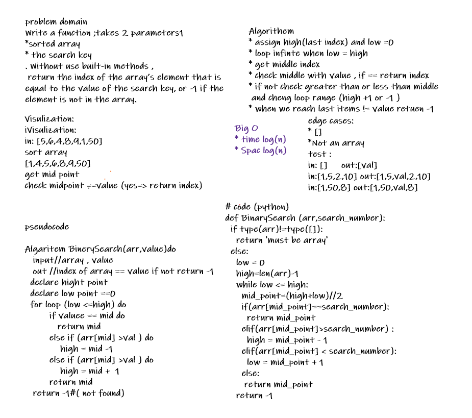

# Reverse an Array
<!-- Description of the challenge -->
Write a function ;takes 2 parameters1
sorted array and the search key
Without use built-in methods ,
 return the index of the array’s element that is equal to the value of the search key, or -1 if the element is not in the array.
## Whiteboard Process
<!-- Embedded whiteboard image -->

## Approach & Efficiency
<!-- What approach did you take?
 Discuss Why. What is the Big O space/time for this approach? -->
 the visual was the basic point , not easy to figure out the idea 
 use loop throug the array , and change range loop depand on value and new middle point 
 I was divided step /2 so log will be log
