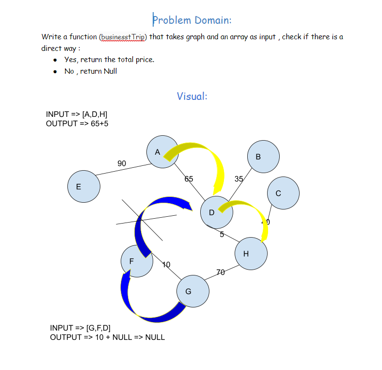

# Challenge Summary
<!-- Description of the challenge -->
Given a business trip itinerary, and an Alaska Airlines route map, is the trip possible with direct flights? If so, how much will the total trip cost be?

## Whiteboard Process
<!-- Embedded whiteboard image -->

## Approach & Efficiency
<!-- What approach did you take? Why? What is the Big O space/time for this approach? -->
Big O 
Time: O(n)
Space: O(n)
## Solution
<!-- Show how to run your code, and examples of it in action -->
[code](graph_business_trip.py)

[test](test_graph_business_trip.py)