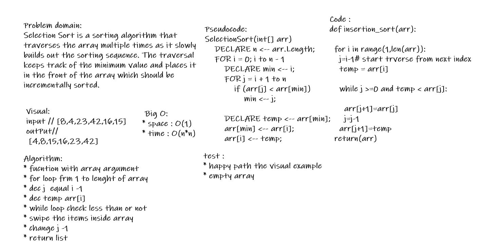

# Challenge Summary
<!-- Description of the challenge -->
Selection Sort is a sorting algorithm that traverses the array multiple times as it slowly builds out the sorting sequence. The traversal keeps track of the minimum value and places it in the front of the array which should be incrementally sorted.

## Whiteboard Process
<!-- Embedded whiteboard image -->

## Approach & Efficiency
<!-- What approach did you take? Why? What is the Big O space/time for this approach? -->
Space big O 1 
No additional space is being created. This array is being sorted in place…keeping the space at constant O(1).

time Big O n*n
The basic operation of this algorithm is comparison. This will happen n * (n-1) number of times…concluding the algorithm to be n squared.

## Solution
<!-- Show how to run your code, and examples of it in action -->

[BLOG link](BLOG.md)

[code link](insertion_sort.py)

[test code link](test_insertion_sort.py)
