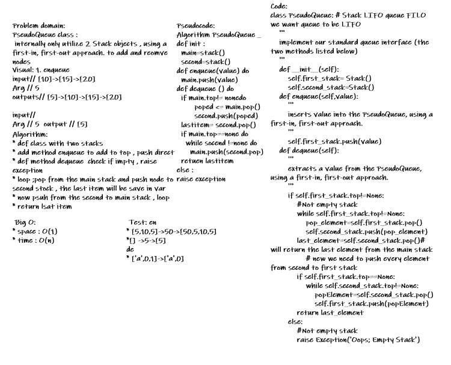

# Challenge Summary
<!-- Description of the challenge -->
Create a brand new PseudoQueue class. Do not use an existing Queue. Instead, this PseudoQueue class will implement our standard queue interface (the two methods listed below), but will internally only utilize 2 Stack objects. Ensure that you create your class with the following methods:

## Whiteboard Process
<!-- Embedded whiteboard image -->

## Approach & Efficiency
<!-- What approach did you take? Why? What is the Big O space/time for this approach? -->
* init(self) - initialization of the PseudoQueue class with the 2 STACKS
* enqueue(value) - Method to inserts value into the PseudoQueue, using a first-in, first-out approach.
dequeue() - Method to extract a value from the PseudoQueue, using a first-in, first-out approach. Returns value of extracted node
## Solution
<!-- Show how to run your code, and examples of it in action -->
[code link](../../challenges/queue_with_stacks/queue_with_stacks.py)